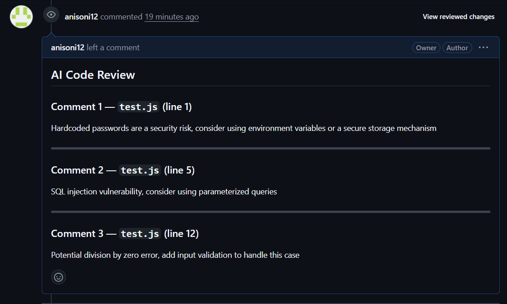

# AI Code Review Bot

A GitHub bot that automatically reviews pull requests using AI. When a developer opens a PR, the bot fetches the diff, sends it to an LLM, and posts a structured code review with bugs, security issues, and improvement suggestions — in under 10 seconds.




---

## What it does

- Listens for `pull_request` events via GitHub webhooks
- Verifies every request with HMAC-SHA256 signature to prevent spoofing
- Fetches the PR diff using the GitHub REST API
- Parses the diff into structured file and line objects
- Sends the diff to Groq (LLaMA 3.3 70B) with a senior engineer review prompt
- Posts a formatted code review back to the PR via GitHub's Reviews API
- Responds to GitHub within 200ms and processes the review asynchronously

---

## Demo

Open a PR with this code:

```javascript
const password = "admin123";

function getUser(id) {
  const query = "SELECT * FROM users WHERE id = " + id;
  db.query(query, callback);
}

function divide(a, b) {
  return a / b;
}
```

The bot automatically posts:

> **Comment 1 — `test.js` (line 1)**
> Hardcoded passwords are a security risk. Use environment variables or a secrets manager instead.
>
> **Comment 2 — `test.js` (line 5)**
> SQL injection vulnerability. Use parameterized queries to sanitize user input.
>
> **Comment 3 — `test.js` (line 12)**
> Potential division by zero. Add input validation before performing division.

---

## Tech stack

| Layer | Technology |
|---|---|
| Runtime | Node.js + TypeScript |
| Server | Express.js |
| GitHub integration | @octokit/rest |
| AI model | Groq — LLaMA 3.3 70B Versatile |
| Security | HMAC-SHA256 webhook verification |
| Deployment | Railway |
| Dev tunneling | ngrok |

---

## Architecture

```
Developer opens PR
       │
       ▼
GitHub fires webhook POST
       │
       ▼
Express server (Railway)
  ├── Verify HMAC-SHA256 signature
  ├── Respond 200 immediately
  └── Dispatch async review pipeline
             │
             ▼
      GitHub REST API
      └── Fetch PR diff
             │
             ▼
      Diff parser
      └── Parse into structured {file, line, content}
             │
             ▼
      Groq API (LLaMA 3.3 70B)
      └── Send diff + system prompt
      └── Receive structured JSON review
             │
             ▼
      GitHub Reviews API
      └── Post formatted review to PR
```

---

## Project structure

```
src/
├── server.ts                   # Express app entry point
├── config.ts                   # Environment variables
├── routes/
│   └── webhook.ts              # POST /api/webhook handler
├── services/
│   ├── github.ts               # GitHub API — fetch diff, post review
│   ├── openai.ts               # Groq API — build prompt, call LLM, parse response
│   └── review.ts               # Orchestrator — ties the full pipeline together
├── utils/
│   ├── verify-signature.ts     # HMAC-SHA256 webhook verification
│   └── diff-parser.ts          # Raw git diff → structured objects
└── types/
    └── index.ts                # TypeScript interfaces
```

---

## Getting started

### Prerequisites

- Node.js 18+
- A GitHub account and repository
- A [Groq API key](https://console.groq.com) (free)
- [ngrok](https://ngrok.com) for local development

### Installation

```bash
git clone https://github.com/anisoni12/AI-code-reviewer.git
cd AI-code-reviewer
npm install
```

### Environment variables

Copy `.env.example` to `.env` and fill in your values:

```bash
cp .env.example .env
```

```env
GITHUB_TOKEN=your_github_personal_access_token
GITHUB_WEBHOOK_SECRET=your_webhook_secret
GROQ_API_KEY=your_groq_api_key
PORT=3001
NODE_ENV=development
```

**GitHub token permissions required:** `repo` (full repository access)

### Running locally

Start the dev server:

```bash
npm run dev
```

Expose it with ngrok:

```bash
ngrok http 3001
```

### GitHub webhook setup

1. Go to your repo → Settings → Webhooks → Add webhook
2. Payload URL: `https://your-ngrok-url.ngrok-free.app/api/webhook`
3. Content type: `application/json`
4. Secret: same value as `GITHUB_WEBHOOK_SECRET` in `.env`
5. Events: select **Pull requests** only
6. Click **Add webhook**

Open a PR on your repo — the bot will review it automatically.

---

## Key technical decisions

**Why respond 200 before processing?**
GitHub retries webhooks that don't get a response within 10 seconds. The review pipeline (API calls + LLM) takes longer than that. The server responds immediately and processes the review asynchronously to prevent duplicate reviews from retries.

**Why HMAC-SHA256 with timingSafeEqual?**
Standard string comparison is vulnerable to timing attacks — an attacker can measure response time differences to guess the signature byte by byte. `crypto.timingSafeEqual` takes constant time regardless of where the comparison fails.

**Why batch all comments in one API call?**
GitHub's API allows 5000 requests per hour. Posting one comment per line on a large PR would burn through that quota fast. Batching all comments in a single `createReview` call uses one request regardless of comment count.

---

## Deployment

The bot is deployed on [Railway](https://railway.app). Push to `master` and Railway auto-deploys.

Update your GitHub webhook URL to the Railway production URL after deployment.

---

## What I learned building this

- GitHub webhook event system and HMAC signature verification
- Why async dispatch matters for webhook handlers
- Parsing unified git diff format into structured objects
- Prompt engineering for consistent JSON output from LLMs
- Debugging ghost processes intercepting ports on Windows
- Production-safe error handling for chained async API calls

---

## Author

**Anish Soni** — Full Stack Developer  
[GitHub](https://github.com/anisoni12) · [LinkedIn](https://linkedin.com/in/anishsonix) · anishsoni.in@gmail.com

---

## License

MIT
